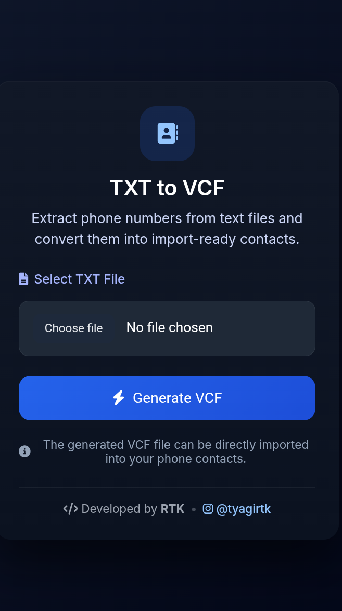

📇 Contact Extractor (TXT + Image → VCF / CSV / Excel)

  
  
  
  

  <b>Turn messy data into clean contacts in seconds 🚀</b>

---

🔥 Overview

A powerful open-source web tool to extract phone numbers from TXT files and images (OCR) and convert them into:

- 📇 VCF (Contacts)
- 📊 CSV
- 📈 Excel

---

🚀 Features

- 📄 Extract numbers from TXT files
- 📷 OCR-based extraction from images (Tesseract)
- 📇 Export contacts as VCF
- 📊 Export as CSV / Excel
- ⚡ Fast processing
- 📱 Mobile-friendly UI

---

🛠️ Tech Stack

- ⚙️ Backend: Flask
- 🎨 Frontend: HTML, CSS
- 🧠 OCR: Tesseract
- 📊 Data Processing: Pandas

---

📸 Screenshots

  

---

⚙️ Installation (Termux)

1️⃣ Update

pkg update && pkg upgrade

2️⃣ Install packages

pkg install python clang make cmake ninja pkg-config libopenblas tesseract

3️⃣ Setup environment

export CFLAGS="-O3"
export LDFLAGS="-lopenblas"

4️⃣ Upgrade pip

pip install --upgrade pip setuptools wheel cython

5️⃣ Install dependencies

pip install numpy pandas flask pillow pytesseract openpyxl

6️⃣ Run app

python contact.py

Open:

http://localhost:5000

---

💻 Installation (PC / Laptop)

pip install -r requirements.txt
python contact.py

---

📁 Supported Inputs

- ".txt"
- ".png", ".jpg", ".jpeg"

---

📤 Export Formats

- 📇 VCF (Mobile contacts)
- 📊 CSV
- 📈 Excel (.xlsx)

---

🧠 How It Works

- 🔍 Regex detects Indian phone numbers
- 🧾 OCR extracts text from images
- 🧹 Data cleaned and formatted
- 📤 Exported to selected format

---

🧩 Project Structure

├── contact.py
├── templates/
├── static/
├── screenshots/
├── requirements.txt
└── README.md

---

🤝 Contributing

Contributions are welcome!

# Fork the repo
# Create a new branch
git checkout -b feature-name

# Make changes
# Commit
git commit -m "Add feature"

# Push
git push origin feature-name

Then open a Pull Request 🚀

---

💡 Future Improvements

- 🔤 Auto contact name detection
- 📦 Bulk image upload
- ✏️ Contact preview/edit
- 📱 Android APK version

---

📜 License

This project is licensed under the MIT License

---

👨‍💻 Developer

RTK
📸 Instagram: https://instagram.com/tyagirtk

---

⭐ Support

If you like this project:

- ⭐ Star the repo
- 🍴 Fork it
- 🧠 Suggest features

---

📁 Supported Inputs

- ".txt"
- ".png", ".jpg", ".jpeg"

---

📤 Export Formats

- VCF (for mobile contacts)
- CSV (Excel compatible)
- Excel (.xlsx)

---

🧠 How it Works

- Regex extracts Indian phone numbers
- OCR reads text from images
- Cleaned data is exported into structured formats

---

🤝 Contributing

Contributions are welcome!

1. Fork the repo
2. Create a new branch
3. Make your changes
4. Submit a pull request

---

💡 Future Ideas

- Contact name detection
- Bulk image upload
- Contact preview/edit before download
- Android APK version

---

📜 License

MIT License

---

👨‍💻 Developer

RTK
Instagram: https://instagram.com/tyagirtk

⚠️ Notes

- Installing "numpy" and "pandas" may take time on Termux.
- Ensure enough storage and stable internet.
- If build fails, re-run installation commands.

---

💻 Installation (PC / Laptop)

pip install -r requirements.txt
python contact.py

---

🚀 Features

- Extract phone numbers from TXT files
- OCR support (Image → Text → Numbers)
- Export formats:
  - VCF (Contacts)
  - CSV
  - Excel
